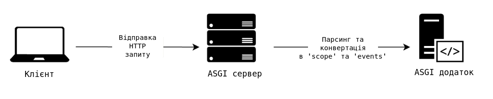
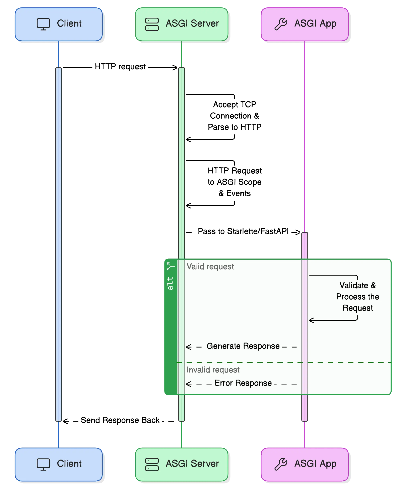

# ASGI протокол в FastAPI

`ASGI`, або асинхронний інтерфейс шлюзу сервера (`Asynchronous Server Gateway Interface`), є основою FastAPI, що забезпечує асинхронне програмування шляхом використання стандартизованого інтерфейсу між програмою та сервером. `ASGI` розвинувся з `WSGI` (`Web Server Gateway Interface`) для підтримки веб-функцій реального часу, таких як `WebSockets` та кілька одночасних підключень, що дозволяє програмам на `Python` обробляти високі навантаження без блокування. Наразі протокол `ASGI` описує `HTTP/1.1`, `HTTP/2` та `WebSocket`.



Ось як виглядає потік запитів застосунку `ASGI` на дуже високому рівні. Коли клієнт надсилає HTTP-запит, сервер `ASGI` приймає запит, аналізує та перетворює його на область видимості (`scope`) та події (`events`). Потім додаток `ASGI` отримує область видимості (`scope`) та події (`events`) й оброблює запит.

## ASGI компоненти
### **Області видимості (`scope`):**

`ASGI` визначає область видимості для кожного з'єднання. Це словник, що містить метадані з'єднання. Для HTTP-запитів він включає метод (`method`), шлях (`path`), рядок запиту (`query string`), заголовки (`headers`) тощо. Кожен запит або з'єднання інкапсульовано в унікальну область видимості (`scope`).

Приклад HTTP scope:
```python
scope = {
    "type": "http", # тип з'єднання ("http", "websocket")
    "http_version": "1.1",  # HTTP версія (1.0б 1.1 2.0)
    "method": "GET",  # HTTP метод (GET, POST, DELETE...)
    "path": "/hello",  # URL шлях, на який робить запит клієнт
    "query_string": b"name=John",  # рядок запиту (?name=John)
    "headers": [  # заголовки HTTP/Websocket
        (b"host", b"example.com"),
        (b"user-agent", b"Mozilla/5.0"),
        (b"accept", b"text/html"),
    ],
    "client": ("127.0.0.1", 12345),  # IP адреса та порт клієнта
    "server": ("127.0.0.1", 8000),  # IP адреса та порт сервера
}

```

### **Події (`events`):**

`ASGI` працює з подіями для обробки запитів. Події – це асинхронні функції, що використовуються для отримання вхідних даних або надсилання вихідних даних:

**`Receive`**: асинхронна функція (`awaitable`), яка викликається програмою для отримання подій (`events`) (таких як HTTP-запити або повідомлення `WebSocket`).

**`Send`**: Асинхронна функція (`awaitable`), яку програма використовує для надсилання відповідей назад клієнту.

### **Події життєвого циклу (`lifespan`):**

`ASGI` також підтримує події життєвого циклу, які обробляють операції запуску та завершення роботи. Ці події дозволяють виконувати завдання налаштування або очищення (такі як ініціалізація або закриття підключення до бази даних) під час запуску або зупинки сервера.

Приклад:

```python
@asynccontextmanager
async def create_tables(_: FastAPI):
    async with aiomysql.connect(**MYSQL_CONNECTION_DATA) as connection:
        cursor: aiomysql.Cursor = await connection.cursor()
        await cursor.execute(
            """
            CREATE TABLE IF NOT EXISTS users (
                id INT AUTO_INCREMENT,
                name VARCHAR(50),
                email VARCHAR(50),
                PRIMARY KEY(id)
            );
            """
        )
    print("Програма запущена")
    yield

    print("Програма зупинена") # буде запущена після завершення роботи сервера (Ctrl+C)

app = FastAPI(title="My API", lifespan=create_tables)
```

Базовий приклад простого `ASGI` додатку:
```python
async def app(scope, receive, send):
    assert scope['type'] == 'http'

    await send({
        'type': 'http.response.start',
        'status': 200,
        'headers': [
            [b'content-type', b'text/plain'],
        ],
    })
    await send({
        'type': 'http.response.body',
        'body': b'Hello from simple ASGI application.',
    })

```

## `Uvicorn` – сервер `ASGI`

`Uvicorn` – це сервер `ASGI`, який забезпечує роботу додатків на `FastAPI`. FastAPI додаток може бути запущений з будь-яким іншим сервером `ASGI`. `Uvicorn` сервер розроблений для швидкої та ефективної роботи, що робить його ідеальним вибором для програм, які потребують паралельності (конкурентності). `Uvicorn` побудовано на базі бібліотеки `uvloop`, яка реалізіє високопродуктивний циклу подій `asyncio`, що покращує його здатність ефективно обробляти задачі, які пов'язані з вводом/виводом (`IO-Bound`).

### Життєвий цикл запиту в Uvicorn:

#### **Прийняття з'єднання:**
`Uvicorn` приймає вхідне HTTP-з’єднання та створює `ASGI` `scope` із деталями запиту (заголовки, метод, шлях тощо).

#### **Відправлення запиту:** 
`Uvicorn` передає цей `scope` застосунку `FastAPI`. Завдяки `uvloop` він асинхронно керує обробкою запиту.

#### **Отримання даних:** 
`Uvicorn` приймає дані запиту через `ASGI`-події `receive`.

#### **Надсилання відповіді:** 
`FastAPI` формує відповідь та надсилає її через `ASGI`-події `send`. `Uvicorn` упаковує її (статус, заголовки, тіло) і відправляє клієнту.




## Детальний цикл подій від початку запиту від клієнта до відправлення йому відповіді від сервера

### 1. Клієнт надсилає HTTP-запит:

Клієнт надсилає HTTP-запит на сервер. Наприклад, GET-запит до ендпоінту `/hello`.

```txt
GET /hello HTTP/1.1
Host: 127.0.0.1:8000
User-Agent: curl/7.64.1
Accept: */*
```

### 2. `Uvicorn` приймає запит:

`Uvicorn` запускає сокет-сервер, який прослуховує вхідні TCP-з'єднання на вказаному хості/порті (наприклад, `127.0.0.1:8000`).

Коли надходить HTTP-запит, `Uvicorn`:
- Приймає TCP-з'єднання.
- Парсить HTTP-запит з необроблених (сирих) TCP-даних за допомогою `h11` (бібліотека `HTTP/1.1` на чистому Python) або `httptools`. Тут `Uvicorn` конвертує вхідний запит в `ASGI` `scope` та `events`.

### 3. `Uvicorn` конвертує HTTP-запит в `scope` `ASGI`:
Коли `Uvicorn` отримує HTTP-запит, він перетворює його на об'єкт `scope` `ASGI`.

### 4. `Uvicorn` передає `scope` до `ASGI` додатку:
Після того, як `Uvicorn` створить `scope` `ASGI`, він запустить застосунок `ASGI`, викликавши об'єкт, що можна викликати (`callable`):

```python
async def app(scope, receive, send) -> None:
    ...
```

`Uvicorn` викликає застосунок `FastAPI/Starlette`, передаючи об'єкт `scope`.

### 5. FastAPI обробляє запит:

Так як `FastAPI` використовує `Starlette` для роботи із запитами/відповідями, то він бере на себе управління на цьому етапі. Він зіставляє маршрут (у цьому випадку `/hello`) та викликає відповідний обробник маршруту.

У нашому випадку буде  викликана функція `hello`, коли є запит на маршрут `/hello`. `Starlette` внутрішньо використовує `scope` `ASGI` для зіставлення методу (`method`) та шляху (`path`) вхідного запиту з визначеним маршрутом.

- Об'єкт запиту: `Starlette` створює об'єкт HTTP-запиту з `scope` та `events` `ASGI`, отриманих від `Uvicorn`.

- Отримання подій (`receive`): `Starlette` отримує `events`, що представляють частини HTTP-запиту, включаючи тіло запиту.

```python
request_event = { 
    "type": "http.request", # тип події
    "body": b"",  # тіло запиту
    "more_body": False,  # вказує, чи буде надіслано більше даних
}
```
Поле `body` містить тіло запиту (у випадку `POST`-запиту), а `more_body` повідомляє програмі, чи тіло запиту повне, чи будуть передані додаткові дані (корисно для потокової передачі великих файлів).

- Обробка відповідей: Маршрут `hello` повертає `JSONResponse`, який обгортає дані відповіді та надсилає їх назад як `events` `ASGI`.

### 6. `Starlette` повертає відповідь

Після обробки запиту `Starlette` надсилає відповідь назад до `Uvicorn`, генеруючи `events` `ASGI`, такі як `http.response.start` та `http.response.body`:

- Запуск відповіді (`http.response.start`):
```python
response_start_event = {
    "type": "http.response.start",
    "status": 200,  # HTTP статут код
    "headers": [
        (b"content-type", b"application/json"),
    ],
}
```
Це повідомляє `Uvicorn` про необхідність почати надсилання HTTP-заголовків відповіді з кодом відповіді 200 та типом контенту `application/json`.

 - Надсилання тіла відповіді (`http.response.body`):
```python
response_body_event = {
    "type": "http.response.body",
    "body": b'{"message": "Hello from simple ASGI application!"}',  # тіло відповіді в форматі JSON
    "more_body": False,
}
```
Це надсилає тіло відповіді, що містить JSON-повідомлення `{"message": "Hello from simple ASGI application!"}`. Значення `more_body: False` вказує на те, що це остання частина тіла відповіді, і га цьому відповідь можна вважати завершеною.

### 7. `Uvicorn` надсилає HTTP-відповідь назад клієнту

`Uvicorn` отримує `events` `ASGI`, що генеруються `Starlette`, та перетворює їх на HTTP-відповіді. 

Зокрема:

- подія `http.response.start` дає команду `Uvicorn` для відправки статус коду відповіді `HTTP` та заголовків (наприклад, `HTTP/1.1 200 OK`).
- подія `http.response.body` надсилає тіло відповіді (наприклад, `{"message": "Hello from simple ASGI application!"}`) клієнту.

`Uvicorn` розриває з'єднання, коли всі частини відповіді були відправлені.